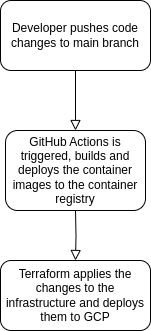
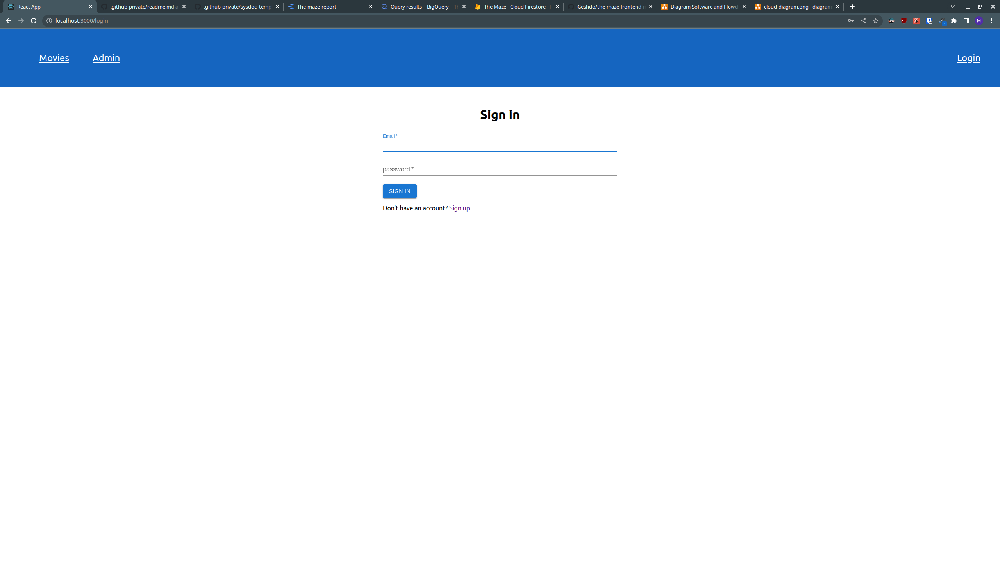

# What does this system do (in summary)

**Who would use it and for what**

The purpose of the application is to rate movies.

**Who built it**

Martin Lindström

**Why did you build it**

The application was built as an exercise to get familiar with the Go programming langauge as well as GitHub Actions and Terraform.

## Architecture

The frontend of the application is built with React, the backend API is built with Go and the database being used is Firestore Database.

The application also uses a pubsub->bigquery flow to track pageviews and added movies.

There is a CI/CD pipeline which consists of GitHub Actions and Terraform that builds the container images for the frontend and the backend and deploys them to two cloud run instances when new code is pushed to the repository.

## Views

Cloud view

Deployment view (from devs computer, how does code move to production)

Front end (what does the user see)

## Security

**What type of data do we store**

The data stored for the movies is insensitive data such as id, title, imdb-link, image-link and rating.

The data stored for the users contain sensitive data such as registered users email and password. The password is hashed and salted before being stored in the database.
