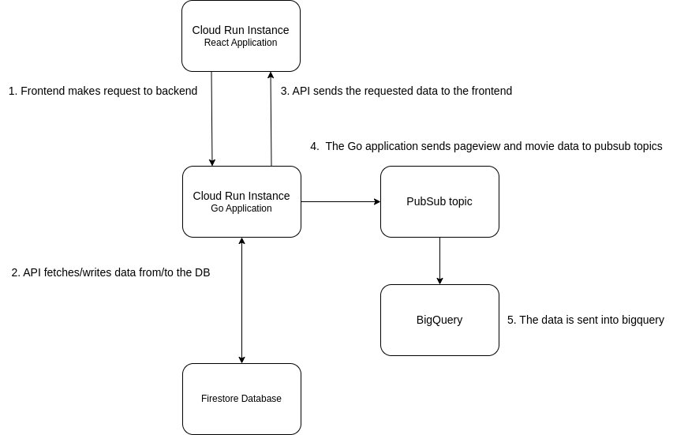
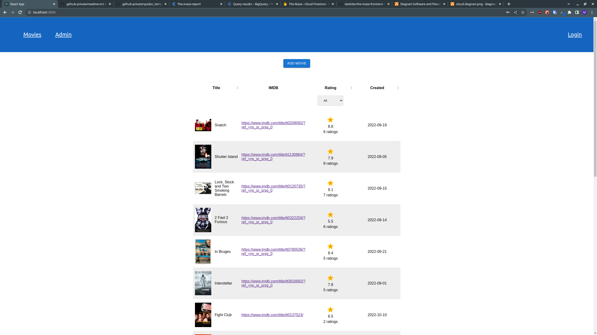

# What does this system do (in summary)

**Who would use it and for what**

The purpose of the application is to rate movies.

**Who built it**

Martin Lindström

**Why did you build it**

The application was built as an exercise for StepStone

## Architecture

The frontend of the application is built with React, the backend API is built with Go and the database being used is Firestore Database.

The application also uses a pubsub->cloud function->bigquery flow to track pageviews and added movies.

There is a Cloud Build CI/CD pipeline set up that deploys the frontend and backend applications to two different Cloud Run instances when new code is pushed to the repositories.

## Views

Cloud view

Deployment view (from devs computer, how does code move to production)

Front end (what does the user see)

## Security

**What type of data do we store**

The data stored for the movies is insensitive data such as id, title, imdb-link, image-link and rating.

The data stored for the users contain sensitive data such as users email, username and password. The password is hashed and salted before being stored in the database.

## Links

Website: https://the-maze-frontend-jxbccvuzla-lz.a.run.app/

Source code frontend: https://github.com/Geshdo/the-maze-frontend-martin

Source code backend: https://github.com/Geshdo/the-maze-backend-martin
